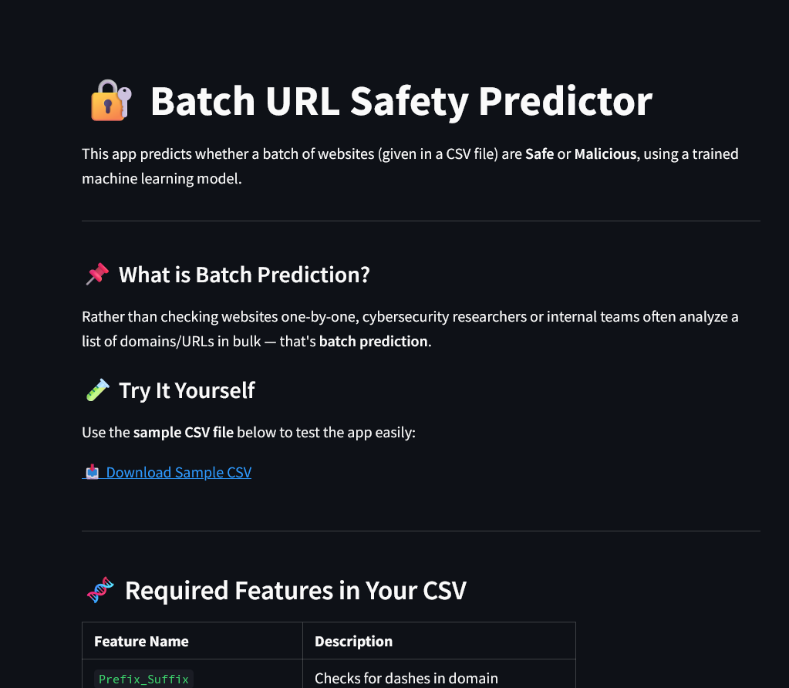
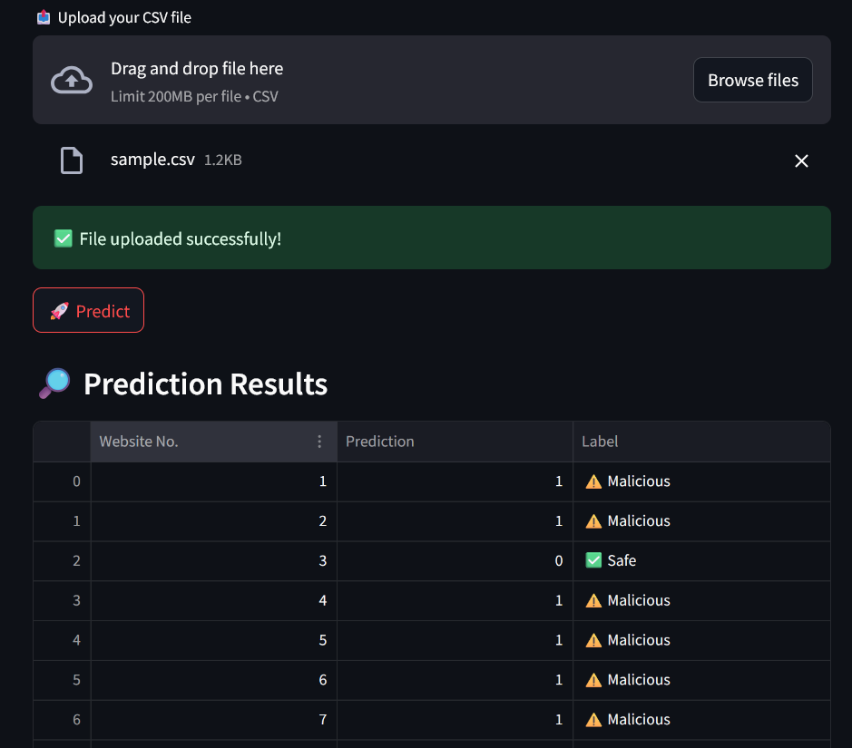
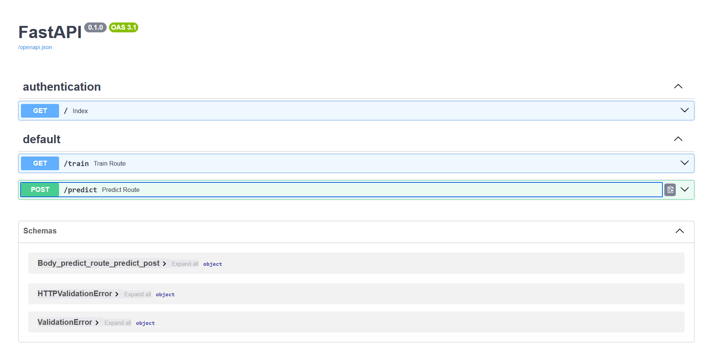
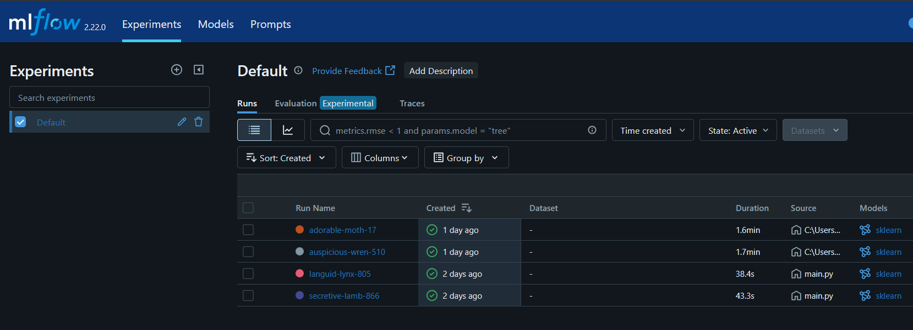

# 🔐 MLOps Solution for Network Security in Malicious URL Detection

This is a comprehensive end-to-end MLOps project designed to detect and classify malicious URLs. It ensures user safety by identifying harmful links using machine learning, with a full pipeline for data ingestion, model training, deployment, and monitoring.

The app supports:

    Batch predictions via an interactive web interface (Streamlit) powered by a backend API (FastAPI)

---

## 📌 Introduction

Malicious URLs are frequently used in phishing, malware, and social engineering attacks. This project applies machine learning to analyze and classify URLs as **safe (0)** or **malicious (1)**.

Our pipeline automates:
- Storing raw data into MongoDB
- Preprocessing and transforming features
- Training and versioning the ML model
- Deploying predictions via APIs and UI
- Hosting on cloud (Railway)

---
## 🧬 Project Architecture

Here is the high-level architecture of our end-to-end MLOps system:


## ⚙️ Tech Stack

| **Category**                  | **Tools / Technologies**                      | **Description**                                                                 |
|------------------------------|-----------------------------------------------|---------------------------------------------------------------------------------|
| **Frontend**                 | Streamlit                                     | Provides a simple UI for real-time and batch URL predictions                    |
| **Backend**                  | FastAPI                                       | REST API that handles batch predictions                                         |
| **Modeling**                 | RandomForestClassifier, Python                | ML model for detecting malicious URLs                                           |
| **Database**                 | MongoDB                                       | Stores raw ingested URL records                                                 |
| **Experiment Tracking**      | MLflow, DagsHub                               | Tracks experiment metrics & model versions                                      |
| **CI/CD**                    | GitHub Actions                                | Automates training, testing, Docker builds, and deployment                      |
| **Containerization**         | Docker                                        | Containerizes the app for consistent deployment                                 |
| **Cloud Hosting**            | Railway                                       | Hosts both frontend and backend apps                                            |

---

## 🚀 Project Highlights

### 🔄 ML Pipeline & Monitoring

- **End-to-End MLOps Pipeline**  
  A fully integrated pipeline from data ingestion, transformation, training, and batch prediction to deployment using modern MLOps tools.

- **Batch Predictions via Web Interface**  
  Users can upload a CSV file through a user-friendly Streamlit frontend and receive predictions processed in batch via a FastAPI backend.

- **Model Training and Inference**  
  A dedicated `/train` endpoint in FastAPI allows retraining the model using the existing dataset to improve accuracy when needed.

- **Experiment Tracking with DagsHub & MLflow**  
  All experiments, metrics, and model versions are tracked using MLflow hosted on DagsHub, enabling reproducibility and performance comparisons.

---

### 🛠 Infrastructure & Deployment

- **Containerized with Docker**  
  The complete application (backend + frontend) is containerized using Docker for consistent local development and production deployment.

- **Deployment with Railway**  
  Both FastAPI and Streamlit apps are deployed seamlessly using [Railway](https://railway.app), enabling simple, scalable cloud hosting.

- **Multiple Interfaces**  
  - **FastAPI Backend**:
    - `/train`: Retrains the model using updated data.
    - `/predict`: Accepts CSV uploads and returns batch predictions.
  - **Streamlit Frontend**:  
    - Offers an interactive UI for users to upload CSV files and view prediction results in a user-friendly format.

---

### 🔁 CI/CD & Version Control

- **Automated CI/CD with GitHub Actions**  
  Streamlined CI/CD process using GitHub Actions for automatic building and deploying Docker images on each commit.

- **Code & Data Versioning**  
  - **Code Versioning**: Handled using Git and GitHub for collaborative and controlled development.  
  - **Data and Experiment Versioning**: Managed via DagsHub, which tracks datasets, models, and experiments using MLflow integration.

## 🔍 Key Features

| **Feature Name**              | **Description**                                     |
|------------------------------|------------------------------------------------------|
| `Prefix_Suffix`              | Checks for dashes in domain                          |
| `having_Sub_Domain`          | Counts number of subdomains                          |
| `SSLfinal_State`             | Analyzes SSL certificate                             |
| `Domain_registration_length` | Measures domain registration duration         |
| `Favicon`                    | Checks favicon source                                |
| `port`                       | Detects unusual ports                                |
| `HTTPS_token`                | Flags 'HTTPS' in domain name                         |
| `Request_URL`                | Checks resource loading domains                      |
| `URL_of_Anchor`              | Analyzes anchor tag destinations                     |
| `Links_in_tags`              | Measures links in HTML tags                          |
| `SFH`                        | Checks form handler locations                        |
| `Submitting_to_email`        | Flags form submission to email                       |
| `Abnormal_URL`               | Identifies URL-domain mismatches                     |
| `Redirect`                   | Counts redirections                                  |
| `on_mouseover`               | Detects JavaScript events                            |
| `RightClick`                 | Identifies right-click disabling                     |
| `popUpWindow`                | Flags popup windows                                  |
| `Iframe`                     | Detects invisible iframes                            |
| `age_of_domain`              | Analyzes domain age                                  |
| `DNSRecord`                  | Checks DNS records                                   |
| `web_traffic`                | Measures website traffic                             |
| `Page_Rank`                  | Checks page rank                                     |
| `Google_Index`               | Identifies Google indexing                           |
| `Links_pointing_to_page`     | Counts inbound links                                 |
| `Statistical_report`         | Flags reported suspicious activity                   |


## 🧩 Components

### 🖥️ Frontend (Streamlit)
The Streamlit app provides an intuitive interface for users to perform **batch predictions** of URLs categorized as **Malicious**, **Suspicious**, or **Safe**.

<!--  -->


### 🧠 Backend (FastAPI)
FastAPI handles the model's operations, such as training and batch prediction:

- **/train Route**: Triggers the training of the model using stored data in the database. This can be invoked manually via FastAPI's `/docs` interface.
  
- **/predict Route**: Accepts a CSV file containing multiple URLs and returns a CSV with predictions for each entry.



## ⚙️ MLOps Pipeline

### 📥 Data Ingestion
- Connected to **MongoDB** for raw data retrieval.
- Exported processed data to a local feature store.
- Split the dataset into **training and testing sets** with proper separation to avoid data leakage.

### ✅ Data Validation
- Verified schema integrity to ensure presence of required columns.
- Performed statistical checks to detect **data drift** in numerical features.
- Generated **drift reports** using visual and numerical summaries for monitoring consistency.

### 🔄 Data Transformation
- Applied preprocessing with **KNNImputer** to handle missing values.
- Transformed data into NumPy arrays for training.
- Saved the **transformation pipeline** as a reusable artifact (`.pkl` file).

### 🤖 Model Training & Evaluation
- Trained using **RandomForestClassifier**.
- Tuned hyperparameters via **GridSearchCV** for optimal results.
- Evaluated using metrics like **Precision, Recall, and F1-score**.
- Experiment tracking managed with **MLflow**, hosted via **DagsHub**.

- Final model saved as a serialized `.pkl` file for deployment.

---

## 🔁 CI/CD Pipeline

- CI/CD handled via **GitHub Actions**, triggered on every code update.
- Automates testing, Docker build, and deployment to **Railway** for seamless delivery.

---

## 🐳 Docker Integration

- Entire application containerized using **Docker** for consistent environments.
- Supports reproducibility from development to production.

## 🚀 How to Run the Project

Set up and run the **Malicious URL Detection** project locally or on **Railway**.

---

### 🔧 Installation

```bash
git clone https://github.com/e5can0r/Network-Security-System-Using-mlops.git
cd Network-Security-System-Using-mlops
pip install -r requirements.txt
```
### 🔧 Local Setup
```bash
cd backend
uvicorn app:app --reload
cd frontend
streamlit run streamlit_app.py
```
## 🔧 Deployment on Railway

### Backend Deployment
```bash
# Create a new Railway project
# Set root directory to: backend
# Start command:
uvicorn app:app --host 0.0.0.0 --port 8000
```
### Frontend Deployment
```bash
# Create another Railway project
# Set root directory to: frontend
# Update `api_url` in streamlit_app.py to deployed backend URL
# Start command:
streamlit run streamlit_app.py
```

---

## 📝 License

This project is licensed under the [MIT License](LICENSE).  
You are free to use, modify, and distribute this software with attribution.

---

## 🙏 Acknowledgements

This project was inspired by best practices in MLOps and structured learnings from the MLOps course by [Krish Naik](https://www.youtube.com/@KrishNaik).  


---

## 🧪 Badges


---

## 🤝 How to Contribute

We welcome contributions to enhance and improve the project!

1. 🍴 Fork the repository  
2. 🌱 Create a new branch (`git checkout -b feature-branch`)  
3. ✨ Make your changes  
4. ✅ Commit your changes (`git commit -m 'Add some feature'`)  
5. 📤 Push to the branch (`git push origin feature-branch`)  
6. 🔁 Open a Pull Request

---


