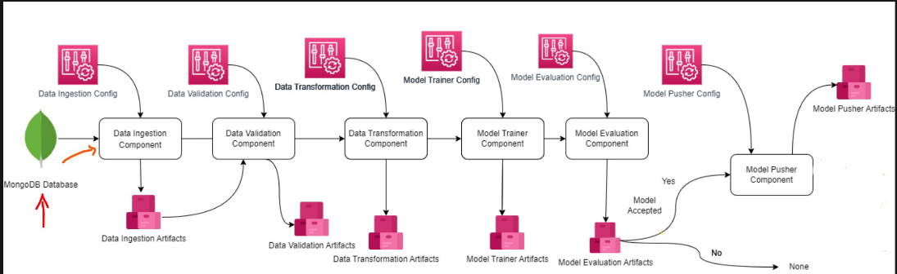

# 🔐 MLOps Solution for Network Security in Malicious URL Detection

This is a comprehensive end-to-end MLOps project designed to **detect and classify malicious URLs**. It ensures user safety by identifying harmful links using machine learning, with a full pipeline for **data ingestion**, **model training**, **deployment**, and **monitoring**. 

The app supports both:
- **Real-time predictions** via a web UI (Streamlit)
- **Batch predictions** via a backend API (FastAPI)

---

## 📌 Introduction

Malicious URLs are frequently used in phishing, malware, and social engineering attacks. This project applies machine learning to analyze and classify URLs as **safe (0)** or **malicious (1)**.

Our pipeline automates:
- Storing raw data into MongoDB
- Preprocessing and transforming features
- Training and versioning the ML model
- Deploying predictions via APIs and UI
- Hosting on cloud (Railway)

---
## 🧬 Project Architecture

Here is the high-level architecture of our end-to-end MLOps system:



## ⚙️ Tech Stack

| **Category**                  | **Tools / Technologies**                      | **Description**                                                                 |
|------------------------------|-----------------------------------------------|---------------------------------------------------------------------------------|
| **Frontend**                 | Streamlit                                     | Provides a simple UI for real-time and batch URL predictions                    |
| **Backend**                  | FastAPI                                       | REST API that handles batch predictions                                         |
| **Modeling**                 | RandomForestClassifier, Python                | ML model for detecting malicious URLs                                           |
| **Database**                 | MongoDB                                       | Stores raw ingested URL records                                                 |
| **Experiment Tracking**      | MLflow, DagsHub                               | Tracks experiment metrics & model versions                                      |
| **CI/CD**                    | GitHub Actions                                | Automates training, testing, Docker builds, and deployment                      |
| **Containerization**         | Docker                                        | Containerizes the app for consistent deployment                                 |
| **Cloud Hosting**            | Railway                                       | Hosts both frontend and backend apps                                            |

---

## 🧠 Features

- ✅ Real-time URL Safety Prediction
- 📤 Batch Prediction via CSV file
- 💾 MongoDB Data Ingestion
- 🔄 MLflow-based model versioning
- 📈 Streamlit frontend with result summary
- 📡 FastAPI backend for batch predictions

---

## 🚀 How It Works

```mermaid
graph TD
    A[User uploads CSV on Streamlit] --> B[Streamlit sends POST request to FastAPI]
    B --> C[FastAPI reads CSV and loads ML model]
    C --> D[Model predicts safe/malicious]
    D --> E[Returns result to Streamlit UI]
    E --> F[Display prediction in table]
